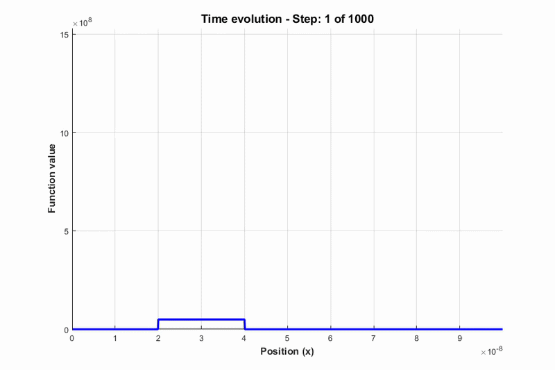
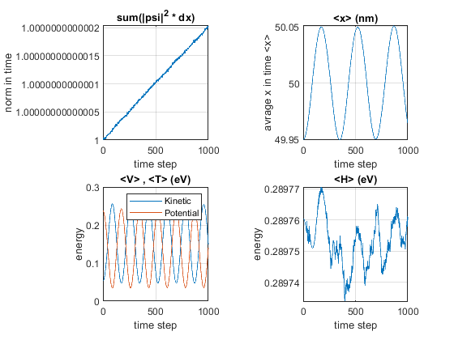

# Split-Step Fourier Wave Simulation

A MATLAB-based quantum wave packet simulator that solves the time-dependent Schrödinger equation using the **Split-Step Fourier Method (SSFM)**. The simulator visualizes the time evolution of an arbitrary initial wave function under user-defined (and time-dependent) potentials.

*Figure 1 — Time evolution of a Gaussian wave packet under a Gaussian potential.*
---

## Overview

This project numerically solves the time-dependent Schrödinger equation:

$$
i\hbar \frac{\partial \psi(x,t)}{\partial t} = \hat{H}\,\psi(x,t), \qquad \hat{H} = \hat{T} + \hat{V}
$$

using the **Split-Step Fourier Method** — an efficient and accurate technique that splits the Hamiltonian into kinetic and potential parts, evaluating each in its natural domain (momentum space for $\hat{T}$, position space for $\hat{V}$).

The user only needs to define:
- An **initial wave function** (e.g., Gaussian or constant wave packet)
- A **potential function** (static or time-dependent)

and the simulator handles the rest.

---

## Features

- **Arbitrary initial wave function** — Gaussian, constant, or user-defined
- **Flexible potential** — harmonic, Gaussian, wall, pulse, Coulomb, breathing harmonic, and more (all provided in `default_function/`)
- **Time-dependent potentials supported**
- **Animated visualization** of wave packet evolution
- **Physical diagnostics over time:**
  1. Probability normalization conservation — `∫|ψ|²dx = 1`
  2. Mean position `⟨x⟩(t)`
  3. Mean kinetic and potential energy `⟨T⟩(t)`, `⟨V⟩(t)`
  4. Total mean energy `⟨E⟩(t)` — verification of energy conservation
- **Modular functional design** — every component is a function, easy to modify and extend
- **Well-structured, readable MATLAB code**

---

## Physics Background

The Split-Step Fourier Method approximates the time propagator over a small time step $\Delta t$ as:

$$
\psi(x, t+\Delta t) \approx e^{-i\hat{V}\Delta t / 2\hbar} \; \mathcal{F}^{-1}\!\left[ e^{-i\hat{T}\Delta t/\hbar} \; \mathcal{F}\!\left[ e^{-i\hat{V}\Delta t/2\hbar}\,\psi(x,t) \right] \right]
$$

- Potential operator `V̂` is applied in **position space**
- Kinetic operator `T̂` is applied in **momentum (Fourier) space**
- This makes the method **unconditionally stable** and **spectrally accurate** in space

---

## Project StructureSplit-Step-Fourier-Wave-Simulation/
├── Start.m # Entry point — configures and runs the simulation
├── core/
│ ├── SSFM.m # Split-Step Fourier solver
│ ├── graph__init__.m # Plotting and animation
│ └── create_animation.m # Animation generation
├── default_function/
│ ├── guass_wave_paket.m
│ ├── const_wave_paket.m
│ ├── guass_potential.m
│ ├── Harmonic_potential.m
│ ├── BreathingHarmonic.m
│ ├── Wall_potential.m
│ ├── PulsePotential.m
│ ├── const_potential.m
│ ├── ocilator_wall.m
│ └── Kolon_potential.m
├── result/ # Generated animations and figures
├── README.md
├── LICENSE
└── .gitignore

---

## Requirements

- **MATLAB R2018a** or newer
- No additional toolboxes required

---

## How to Use

1. Clone or download this repository.
2. Open MATLAB and navigate to the project folder.
3. Open `Start.m`.
4. Choose your initial wave function and potential by uncommenting one line each:

psi_function = guass_wave_paket(mass,"S",mu,region_lenght);
potential_function = guass_potential(mu);

5. Run `Start.m`. The animation and diagnostic plots will appear automatically.

---

## Outputs

The simulator produces the following outputs (saved in `result/`):

| Output | Description |
|---|---|
| `movment_puls.mp4` | Time evolution animation of the wave packet |
| `pols.mp4` | Pulse propagation visualization |
| `result.mp4` | Final simulation summary |
| `wave_packet_motion.mp4` | Wave packet motion under potential |
| `x.fig`, `y.fig` and others | Diagnostic plots |

### Example diagnostic plot

*Figure 2 — Physical diagnostics over time: probability normalization, mean position, kinetic/potential energy, and total energy.*

---

## Potential Applications

- Quantum tunneling and barrier transmission
- Wave packet dynamics in harmonic and anharmonic potentials
- Testbed for numerical methods in quantum mechanics
- Foundation for further research in quantum simulation

---

## Future Work

- Support for 2D and 3D wave packets
- GPU acceleration
- Cross-verification with Python (NumPy)
- Interactive GUI (MATLAB App Designer)

---

## Author

Poya Norouzieh

- Email: poyanorouzieh@gmail.com
- GitHub: @poyanorouzieh

---

## License

This project is licensed under the MIT License.
